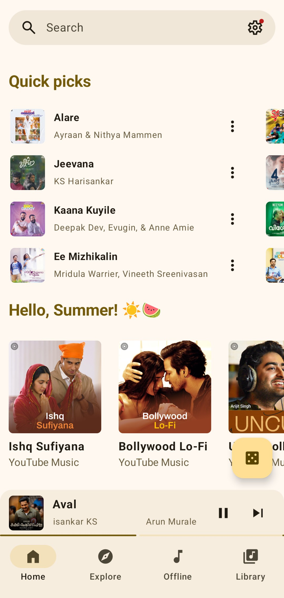

# Flowtune 
<B>A foss Music Streaming application with material design and rich features.
</B>

## Download
[](https://github.com/abhiram79/Flowtune/releases/latest)


## Features 
- Play songs from YT/YT Music without ads
- Background playback
- Search songs, videos, albums, and playlists from YouTube Music
- Login support
- Library management
- Cache and download songs for offline playback
- Synchronized lyrics
- Skip silence
- Audio normalization
- Dynamic themeing
- Material 3 UI
<br>

**Screenshots**
<p align="center">
  
  
  
  
</p>


> **Warning**
>
>If you're in a region where YouTube Music is not supported, you won't be able to use this app
***unless*** you have a proxy or VPN to connect to a YTM supported region.
<br>

## Build From Source

- Open in Android Studio or Build From CLI
```bash
git clone https://github.com/abhiram79/Flowtune.git
cd Flowtune
./gradlew assembleDebug
```
- Change The Google-service.json from in /app/google-xxxxx.json To your own For push notifications
- Sign using your Keystore For Release builds

## Disclaimer

This project is created as a hobby and for learning purposes only. Since it's a personal project, updates may not be consistent and will depend on my available time.

This project and its contents are not affiliated with, funded, authorized, endorsed by, or in any
way associated with YouTube, Google LLC or any of its affiliates and subsidiaries.

Any trademark, service mark, trade name, or other intellectual property rights used in this project
are owned by the respective owners.
<br>

## Credit

I want to give credit to [vfsfitvnm/ViMusic](https://github.com/vfsfitvnm/ViMusic) for being an
example of Jetpack Compose music player. It helped me a lot on my way to learn Compose and
Android development.
Also Special Thanks to [z-haung](https://github.com/z-huang) for [InnerTune](https://github.com/z-huang/InnerTune) as i used this as a base of my project
